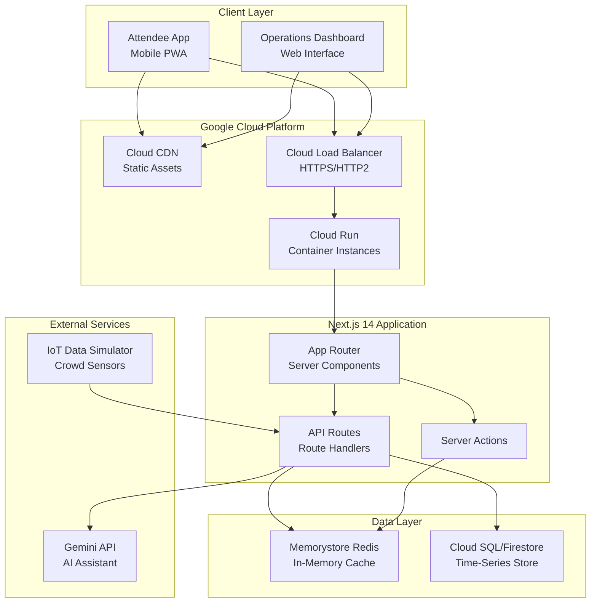
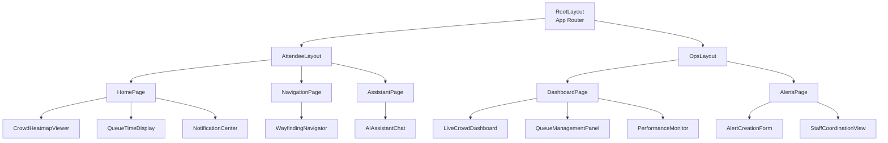

# Design Document: CrowdFlow Platform

## Overview

CrowdFlow is a real-time crowd management platform built with Next.js 14, deployed on Google Cloud Run, and powered by Gemini AI. The system provides two primary interfaces: an Attendee App for event-goers and an Operations Dashboard for venue staff. The platform processes simulated IoT sensor data to deliver crowd density visualization, queue predictions, smart wayfinding, and AI-powered assistance while maintaining strict performance requirements (<500ms API responses, 2-second page loads, 10-second data refresh cycles).

The architecture prioritizes real-time data flow, mobile-first responsive design, WCAG AA accessibility compliance, and privacy-by-design principles (no PII storage, session-only chat data). The system handles concurrent users across multiple venue zones with automatic data updates and proactive notifications.

**Deployment Platform:** Google Cloud Run provides the containerized, serverless deployment environment with automatic scaling, built-in load balancing, and global availability. The platform leverages Cloud Run's container-based architecture for consistent deployments, zero-downtime updates, and cost-effective scaling from zero to thousands of concurrent users.

## Architecture

### System Architecture

The platform follows a containerized architecture leveraging Google Cloud Run with Next.js 14's App Router and React Server Components:



**Architecture Rationale:**

- **Google Cloud Run Deployment**: Fully managed container platform with automatic scaling (0 to N instances), pay-per-use pricing, and multi-region deployment for low-latency API responses (<500ms requirement). Cloud Run provides built-in load balancing, automatic HTTPS, and seamless integration with Google Cloud services
- **Cloud CDN**: Global content delivery network for static assets (images, CSS, JS bundles) with edge caching and integration with Cloud Run
- **Cloud Load Balancer**: HTTPS termination, HTTP/2 support, automatic SSL certificate management, and global load distribution
- **Next.js 14 App Router**: Server Components reduce client-side JavaScript, improving initial load times (2-second requirement). Streaming SSR enables progressive rendering. Next.js standalone output mode optimized for containerized deployments
- **Memorystore for Redis**: Fully managed Redis service stores current crowd density data, queue predictions, and venue zone metadata for sub-100ms read access. Connected to Cloud Run via VPC connector
- **Cloud SQL PostgreSQL or Firestore**: Time-series buffer maintains 5-minute rolling window of crowd density data per zone for trend analysis and prediction accuracy. Cloud SQL for relational queries, Firestore for document-based access
- **Stateless Containers**: Cloud Run instances are stateless; all session data lives client-side or in Memorystore Redis with TTL. Enables horizontal scaling and zero-downtime deployments

### Data Flow Architecture

**Real-Time Update Flow (10-second refresh cycle):**

1. IoT Simulator pushes crowd density updates via webhook to `/api/iot/ingest`
2. API route validates data, updates Vercel KV cache, appends to time-series buffer
3. Server-Sent Events (SSE) or WebSocket connection broadcasts updates to connected clients
4. Client components re-render with new data via React state updates
5. Queue Predictor recalculates wait times based on updated density data

**AI Assistant Flow (3-second response requirement):**

1. User submits query via Attendee App chat interface
2. Client sends POST to `/api/assistant/chat` with query and session context
3. Server Action streams Gemini API response back to client
4. Client displays response incrementally as tokens arrive
5. Session data stored in client-side sessionStorage, cleared on tab close

### Performance Optimization Strategy

**API Response Time (<500ms):**
- Cloud Run multi-region deployment (us-central1, us-east1, europe-west1) for geographic proximity
- Memorystore for Redis cache for hot data (crowd density, predictions) with VPC connector
- Parallel data fetching with Promise.all()
- Response streaming for large payloads
- Aggressive HTTP caching headers (stale-while-revalidate)
- Cloud Run minimum instances (1-2) to avoid cold starts during events
- Container optimization: Next.js standalone build, minimal base image (node:20-alpine)

**Page Load Time (<2 seconds):**
- Server-side rendering for initial HTML
- Code splitting by route and component
- Image optimization with Next.js Image component and Cloud CDN
- Prefetching critical API data during SSR
- Lazy loading for below-the-fold components
- Cloud CDN edge caching for static assets with 1-year cache duration
- HTTP/2 push for critical resources

**Real-Time Updates (10-second refresh):**
- Server-Sent Events for unidirectional data push
- WebSocket support via Cloud Run (HTTP/2 upgrade)
- Optimistic UI updates with background revalidation
- Debounced re-renders to prevent thrashing
- Redis pub/sub for broadcasting updates across Cloud Run container instances

**Cloud Run Configuration:**
- CPU: 2 vCPU per instance
- Memory: 2 GiB per instance
- Max instances: 100 (adjustable based on event size)
- Min instances: 2 (during event hours)
- Concurrency: 80 requests per instance
- Request timeout: 60 seconds (for SSE connections)
- Startup CPU boost: enabled

## Components and Interfaces

### Attendee App Components

**1. CrowdHeatmapViewer**
- Displays venue map with color-coded density overlay
- Props: `venueZones: VenueZone[]`, `densityData: DensitySnapshot`
- Renders SVG-based map with accessibility labels
- Updates via SSE connection to `/api/realtime/density`

**2. QueueTimeDisplay**
- Shows wait time predictions for food stalls and entry gates
- Props: `predictions: QueuePrediction[]`, `userLocation?: Coordinates`
- Sorts by proximity to user location
- Displays confidence indicator when historical data is limited

**3. WayfindingNavigator**
- Interactive map with turn-by-turn route guidance
- Props: `origin: Coordinates`, `destination: string`, `crowdData: DensitySnapshot`
- Recalculates route when crowd conditions change >20% density
- Provides haptic feedback at waypoints (mobile)

**4. AIAssistantChat**
- Conversational interface for event queries
- Props: `sessionId: string`, `venueContext: VenueMetadata`
- Streams responses from Gemini API
- Stores conversation in sessionStorage only
- Auto-clears on session end

**5. NotificationCenter**
- Manages push notifications and user preferences
- Props: `userId: string`, `preferences: NotificationPreferences`
- Implements rate limiting (3 per 15 minutes)
- Filters by user location and alert priority

**6. StaffAlertPanel** (Staff Mode)
- Displays assigned tasks and incident alerts
- Props: `staffId: string`, `activeAlerts: Alert[]`
- Allows status updates (acknowledged, in-progress, resolved)
- Shows real-time location of other staff members

### Operations Dashboard Components

**1. LiveCrowdDashboard**
- Full-screen heatmap with zone statistics
- Props: `venueZones: VenueZone[]`, `densityData: DensitySnapshot`, `historicalTrends: TimeSeries`
- Highlights critical density zones with pulsing border
- Displays last update timestamp
- Supports drill-down to individual zone details

**2. QueueManagementPanel**
- Tabular view of all monitored queues
- Props: `queuePredictions: QueuePrediction[]`, `actualWaitTimes?: ActualWaitTime[]`
- Shows prediction accuracy metrics
- Allows manual override for special conditions

**3. AlertCreationForm**
- Interface for creating and dispatching staff alerts
- Props: `availableStaff: StaffMember[]`, `venueZones: VenueZone[]`
- Validates required fields (priority, location, description)
- Confirms delivery status after dispatch

**4. StaffCoordinationView**
- Real-time staff location and task status
- Props: `activeStaff: StaffMember[]`, `activeAlerts: Alert[]`
- Displays staff availability and current assignments
- Supports drag-and-drop task reassignment

**5. PerformanceMonitor**
- System health and performance metrics
- Props: `metrics: SystemMetrics`
- Displays API response times, error rates, active connections
- Shows loading indicators when requests exceed 200ms

### Component Communication Patterns

**State Management:**
- React Context for global app state (user session, venue metadata)
- Zustand for client-side reactive state (crowd data, notifications)
- React Query for server state synchronization and caching
- No Redux (unnecessary complexity for this use case)

**Real-Time Communication:**
- Server-Sent Events (SSE) for crowd density updates
- WebSocket fallback for bidirectional staff coordination
- Polling fallback (15-second interval) for unsupported browsers

**Component Hierarchy:**



## Data Models

### Core Domain Models

**VenueZone**
```typescript
interface VenueZone {
  id: string;                    // Unique zone identifier
  name: string;                  // Human-readable name
  type: ZoneType;                // 'concourse' | 'gate' | 'concession' | 'seating'
  capacity: number;              // Maximum safe occupancy
  coordinates: Polygon;          // Geographic boundary
  adjacentZones: string[];       // Connected zone IDs for pathfinding
  facilities: Facility[];        // Food stalls, restrooms, etc.
}

type ZoneType = 'concourse' | 'gate' | 'concession' | 'seating' | 'emergency_exit';

interface Polygon {
  points: Coordinates[];
}

interface Coordinates {
  lat: number;
  lng: number;
}
```

**DensitySnapshot**
```typescript
interface DensitySnapshot {
  timestamp: number;             // Unix timestamp (ms)
  zones: ZoneDensity[];
}

interface ZoneDensity {
  zoneId: string;
  currentOccupancy: number;      // Estimated people count
  densityLevel: DensityLevel;    // Computed from occupancy/capacity
  trend: Trend;                  // 'increasing' | 'stable' | 'decreasing'
}

type DensityLevel = 'low' | 'moderate' | 'high' | 'critical';
type Trend = 'increasing' | 'stable' | 'decreasing';

// Density level thresholds:
// low: 0-40% capacity
// moderate: 41-70% capacity
// high: 71-90% capacity
// critical: 91-100% capacity
```

**QueuePrediction**
```typescript
interface QueuePrediction {
  facilityId: string;
  facilityName: string;
  facilityType: 'food_stall' | 'entry_gate' | 'restroom';
  predictedWaitMinutes: number;  // Whole number, rounded up
  confidence: ConfidenceLevel;   // Based on historical data availability
  lastUpdated: number;           // Unix timestamp (ms)
  queueLength: number;           // Estimated people in queue
}

type ConfidenceLevel = 'high' | 'medium' | 'low' | 'insufficient_data';

// Confidence levels:
// high: >100 historical samples
// medium: 50-100 samples
// low: 10-49 samples
// insufficient_data: <10 samples
```

**Route**
```typescript
interface Route {
  id: string;
  origin: Coordinates;
  destination: Coordinates;
  waypoints: Waypoint[];
  estimatedDurationMinutes: number;
  totalDistanceMeters: number;
  avoidedZones: string[];        // High/critical density zones bypassed
  createdAt: number;
}

interface Waypoint {
  coordinates: Coordinates;
  instruction: string;           // "Turn left at Gate 5"
  zoneId: string;
  densityLevel: DensityLevel;
}
```

**Alert**
```typescript
interface Alert {
  id: string;
  priority: AlertPriority;
  type: AlertType;
  title: string;
  description: string;
  location: {
    zoneId: string;
    coordinates?: Coordinates;
  };
  createdBy: string;             // Manager user ID
  createdAt: number;
  assignedStaff: string[];       // Staff member IDs
  status: AlertStatus;
  acknowledgedBy: string[];      // Staff who acknowledged
  resolvedAt?: number;
}

type AlertPriority = 'low' | 'medium' | 'high' | 'critical';
type AlertType = 'crowd_control' | 'medical' | 'security' | 'maintenance' | 'general';
type AlertStatus = 'pending' | 'acknowledged' | 'in_progress' | 'resolved' | 'cancelled';
```

**ChatSession**
```typescript
interface ChatSession {
  sessionId: string;             // Client-generated UUID
  messages: ChatMessage[];
  venueContext: {
    venueId: string;
    eventId: string;
    userLocation?: Coordinates;
  };
  createdAt: number;
  expiresAt: number;             // Auto-expire after 4 hours
}

interface ChatMessage {
  id: string;
  role: 'user' | 'assistant';
  content: string;
  timestamp: number;
}

// Note: ChatSession stored in sessionStorage only, never persisted server-side
```

**NotificationPreferences**
```typescript
interface NotificationPreferences {
  userId: string;                // Anonymous session ID
  enabledTypes: NotificationType[];
  densityAlerts: boolean;
  waitTimeAlerts: boolean;
  venueAnnouncements: boolean;
  staffAlerts: boolean;          // Staff only
  lastModified: number;
}

type NotificationType = 'density' | 'wait_time' | 'venue_announcement' | 'staff_alert';
```

### Data Storage Strategy

**Memorystore for Redis - Hot Data:**
- Current density snapshots (TTL: 30 seconds)
- Queue predictions (TTL: 60 seconds)
- Active alerts (TTL: until resolved)
- Staff locations (TTL: 20 seconds)
- Venue zone metadata (no TTL, updated manually)
- Connected to Cloud Run via Serverless VPC Access connector

**Time-Series Buffer (Cloud SQL PostgreSQL or Firestore):**
- 5-minute rolling window of density data per zone
- Used for trend calculation and prediction model
- Partitioned by zone ID for efficient queries
- Automatically purges data older than 5 minutes
- Cloud SQL for relational queries with connection pooling, Firestore for document-based access with automatic scaling

**Client-Side Storage:**
- sessionStorage: Chat conversations, user preferences
- localStorage: Notification preferences (persists across sessions)
- IndexedDB: Offline venue map tiles (PWA support)

**No Persistent Storage For:**
- Individual user tracking data
- Personally identifiable information
- Chat conversation history beyond active session
- User location history

## API Design

### REST API Endpoints

**Crowd Density APIs**

`GET /api/crowd/density`
- Returns current density snapshot for all zones
- Response time target: <200ms
- Cache: 10 seconds (stale-while-revalidate)
- Response:
```typescript
{
  timestamp: number;
  zones: ZoneDensity[];
}
```

`GET /api/crowd/density/:zoneId`
- Returns density data for specific zone with 5-minute history
- Response time target: <150ms
- Response:
```typescript
{
  current: ZoneDensity;
  history: ZoneDensity[];  // Last 5 minutes
}
```

`POST /api/iot/ingest`
- Webhook endpoint for IoT simulator data
- Validates and processes incoming sensor data
- Updates cache and broadcasts to connected clients
- Request body:
```typescript
{
  timestamp: number;
  sensorId: string;
  zoneId: string;
  occupancyCount: number;
}
```

**Queue Prediction APIs**

`GET /api/queues/predictions`
- Returns wait time predictions for all facilities
- Response time target: <200ms
- Cache: 15 seconds
- Query params: `?type=food_stall|entry_gate` (optional filter)
- Response:
```typescript
{
  predictions: QueuePrediction[];
  lastUpdated: number;
}
```

`GET /api/queues/predictions/:facilityId`
- Returns prediction for specific facility with confidence metrics
- Response time target: <150ms

**Wayfinding APIs**

`POST /api/wayfinding/route`
- Generates optimized route avoiding congestion
- Response time target: <2000ms (requirement 3.1)
- Request body:
```typescript
{
  origin: Coordinates;
  destination: string;  // Facility name or zone ID
  preferences?: {
    avoidHighDensity: boolean;
    preferAccessible: boolean;
  };
}
```
- Response: `Route` object

`GET /api/wayfinding/recalculate/:routeId`
- Checks if route needs recalculation based on crowd changes
- Returns updated route if density changed >20% in any waypoint zone

**AI Assistant APIs**

`POST /api/assistant/chat`
- Streams Gemini API response for user query
- Response time target: <3000ms (requirement 4.2)
- Uses Server-Sent Events for streaming
- Request body:
```typescript
{
  sessionId: string;
  message: string;
  context: {
    venueId: string;
    userLocation?: Coordinates;
    conversationHistory: ChatMessage[];  // Last 5 messages
  };
}
```
- Response: SSE stream of text chunks

**Alert Management APIs**

`POST /api/alerts/create`
- Creates new staff alert and dispatches notifications
- Response time target: <500ms
- Delivery time target: <5000ms (requirement 6.1)
- Request body: `Alert` object (without id, timestamps)

`PATCH /api/alerts/:alertId/status`
- Updates alert status (acknowledge, in-progress, resolved)
- Request body:
```typescript
{
  status: AlertStatus;
  staffId: string;
}
```

`GET /api/alerts/active`
- Returns all active alerts for operations dashboard
- Response time target: <200ms

**Notification APIs**

`POST /api/notifications/send`
- Sends push notification to specific users or broadcast
- Rate limiting: 3 per 15 minutes per user (requirement 12.4)
- Request body:
```typescript
{
  type: NotificationType;
  priority: AlertPriority;
  title: string;
  body: string;
  targetUsers?: string[];  // Omit for broadcast
  targetZones?: string[];  // Send to users in these zones
}
```

### Real-Time APIs

**Server-Sent Events (SSE)**

`GET /api/realtime/density`
- Streams density updates every 10 seconds
- Event format:
```
event: density_update
data: {"timestamp": 1234567890, "zones": [...]}
```

`GET /api/realtime/alerts`
- Streams new alerts and status updates for staff
- Event types: `alert_created`, `alert_updated`, `alert_resolved`

### API Authentication & Rate Limiting

**Authentication:**
- Anonymous session tokens for attendees (JWT, 4-hour expiry)
- API keys for IoT simulator (validated via header)
- OAuth for operations dashboard (venue staff accounts)

**Rate Limiting:**
- Attendee APIs: 100 requests/minute per session
- IoT ingest: 1000 requests/minute (10 zones × 1 update/10 seconds)
- AI Assistant: 10 requests/minute per session
- Operations Dashboard: 500 requests/minute per user

### Gemini API Integration

**Configuration:**
- Model: `gemini-1.5-flash` (optimized for speed)
- Temperature: 0.7 (balanced creativity/consistency)
- Max tokens: 500 (concise responses)
- System prompt includes venue context, facility locations, event schedule

**Prompt Engineering:**
```typescript
const systemPrompt = `You are a helpful assistant for ${venueName} during ${eventName}.
Current time: ${currentTime}
User location: ${userLocation}

You can help with:
- Venue navigation and facility locations
- Event schedule and timing
- Wait time information
- General venue questions

Keep responses concise (2-3 sentences). If asked about crowd conditions, reference current data.
Do not provide medical, legal, or emergency advice.`;
```

**Error Handling:**
- Timeout after 3 seconds (requirement 4.2)
- Fallback to cached responses for common questions
- Display user-friendly error: "Assistant temporarily unavailable"

**Privacy:**
- No conversation logging to Gemini
- Strip PII from queries before sending
- Session context only (no cross-session learning)


## Error Handling

### Error Classification

**Client-Side Errors:**
- Network failures (offline, timeout)
- Invalid user input (malformed coordinates, empty queries)
- Browser compatibility issues (SSE not supported)
- Session expiration

**Server-Side Errors:**
- External API failures (Gemini API down)
- Data validation failures (malformed IoT data)
- Cache unavailability (Vercel KV connection issues)
- Rate limit exceeded

**Data Quality Errors:**
- Missing sensor data for zone
- Stale data (>30 seconds old)
- Prediction confidence too low
- Invalid route calculation (no path found)

### Error Handling Strategies

**Graceful Degradation:**

1. **IoT Data Failures** (Requirement 11.4)
   - Log error with sensor ID and timestamp
   - Continue using last valid data (up to 30 seconds old)
   - Display warning indicator on dashboard: "Data delayed"
   - If no valid data for >60 seconds, mark zone as "Unknown"

2. **Gemini API Failures** (Requirement 4.2)
   - Timeout after 3 seconds
   - Return cached response for common questions (FAQ fallback)
   - Display error message: "Assistant temporarily unavailable. Try again in a moment."
   - Log failure for monitoring

3. **Real-Time Connection Failures**
   - Automatically attempt reconnection with exponential backoff (1s, 2s, 4s, 8s, max 30s)
   - Fall back to polling mode (15-second interval)
   - Display connection status indicator to user
   - Queue updates during disconnection, sync on reconnect

4. **Queue Prediction Insufficient Data** (Requirement 2.5)
   - Display message: "Prediction unavailable - insufficient historical data"
   - Show last known wait time with timestamp
   - Suggest alternative facilities with available predictions

5. **Wayfinding Route Not Found**
   - Attempt route without crowd avoidance constraint
   - If still fails, suggest nearest alternative destination
   - Display error: "Unable to calculate route. Try a different destination."

**Error Recovery Patterns:**

```typescript
// Retry with exponential backoff
async function fetchWithRetry<T>(
  fetcher: () => Promise<T>,
  maxRetries: number = 3,
  baseDelay: number = 1000
): Promise<T> {
  for (let i = 0; i < maxRetries; i++) {
    try {
      return await fetcher();
    } catch (error) {
      if (i === maxRetries - 1) throw error;
      await sleep(baseDelay * Math.pow(2, i));
    }
  }
  throw new Error('Max retries exceeded');
}

// Fallback to cached data
async function fetchWithFallback<T>(
  fetcher: () => Promise<T>,
  cacheKey: string
): Promise<T> {
  try {
    const data = await fetcher();
    localStorage.setItem(cacheKey, JSON.stringify(data));
    return data;
  } catch (error) {
    const cached = localStorage.getItem(cacheKey);
    if (cached) {
      console.warn('Using cached data due to fetch failure');
      return JSON.parse(cached);
    }
    throw error;
  }
}
```

**User-Facing Error Messages:**

- **Network Error**: "Connection lost. Retrying..."
- **Timeout Error**: "Request taking longer than expected. Please wait..."
- **Data Unavailable**: "Information temporarily unavailable. Showing last known data."
- **Invalid Input**: "Please check your input and try again."
- **Rate Limit**: "Too many requests. Please wait a moment."

**Error Monitoring:**

- Log all errors to Cloud Logging with structured logging
- Track error rates by endpoint and error type with Cloud Monitoring
- Alert on error rate >5% for any endpoint using Cloud Alerting
- Monitor API response time P95 and P99 with Cloud Trace
- Track SSE connection drop rate and Cloud Run container instance health
- Custom dashboards in Cloud Monitoring for real-time operations visibility

## Deployment and Infrastructure

### Containerization

**Docker Configuration:**

The application uses a multi-stage Docker build optimized for Cloud Run:

```dockerfile
# Build stage
FROM node:20-alpine AS builder
WORKDIR /app
COPY package*.json ./
RUN npm ci
COPY . .
RUN npm run build

# Production stage
FROM node:20-alpine AS runner
WORKDIR /app
ENV NODE_ENV=production
RUN addgroup --system --gid 1001 nodejs
RUN adduser --system --uid 1001 nextjs
COPY --from=builder /app/public ./public
COPY --from=builder --chown=nextjs:nodejs /app/.next/standalone ./
COPY --from=builder --chown=nextjs:nodejs /app/.next/static ./.next/static
USER nextjs
EXPOSE 8080
ENV PORT 8080
CMD ["node", "server.js"]
```

**Container Optimization:**
- Next.js standalone output mode reduces image size by 80%
- Alpine Linux base image (minimal attack surface)
- Multi-stage build separates build dependencies from runtime
- Non-root user for security
- Port 8080 (Cloud Run default)

### Cloud Run Configuration

**Service Configuration (cloudrun.yaml):**

```yaml
apiVersion: serving.knative.dev/v1
kind: Service
metadata:
  name: crowdflow-platform
  annotations:
    run.googleapis.com/ingress: all
    run.googleapis.com/launch-stage: BETA
spec:
  template:
    metadata:
      annotations:
        autoscaling.knative.dev/minScale: '2'
        autoscaling.knative.dev/maxScale: '100'
        run.googleapis.com/startup-cpu-boost: 'true'
        run.googleapis.com/vpc-access-connector: crowdflow-connector
        run.googleapis.com/vpc-access-egress: private-ranges-only
    spec:
      containerConcurrency: 80
      timeoutSeconds: 60
      serviceAccountName: crowdflow-sa@PROJECT_ID.iam.gserviceaccount.com
      containers:
      - image: gcr.io/PROJECT_ID/crowdflow-platform:latest
        ports:
        - name: http1
          containerPort: 8080
        env:
        - name: NODE_ENV
          value: production
        - name: REDIS_HOST
          valueFrom:
            secretKeyRef:
              name: redis-config
              key: host
        - name: GEMINI_API_KEY
          valueFrom:
            secretKeyRef:
              name: gemini-api-key
              key: key
        resources:
          limits:
            cpu: '2'
            memory: 2Gi
```

**Scaling Configuration:**
- Min instances: 2 (during events), 0 (off-hours)
- Max instances: 100
- Target concurrency: 80 requests per instance
- CPU throttling: disabled during request processing
- Startup CPU boost: enabled for faster cold starts

### Infrastructure as Code

**Terraform Configuration:**

```hcl
# Cloud Run service
resource "google_cloud_run_service" "crowdflow" {
  name     = "crowdflow-platform"
  location = var.region

  template {
    spec {
      containers {
        image = "gcr.io/${var.project_id}/crowdflow-platform:latest"
        
        resources {
          limits = {
            cpu    = "2"
            memory = "2Gi"
          }
        }

        env {
          name = "REDIS_HOST"
          value_from {
            secret_key_ref {
              name = google_secret_manager_secret.redis_host.secret_id
              key  = "latest"
            }
          }
        }
      }

      service_account_name = google_service_account.crowdflow.email
    }

    metadata {
      annotations = {
        "autoscaling.knative.dev/minScale" = "2"
        "autoscaling.knative.dev/maxScale" = "100"
        "run.googleapis.com/vpc-access-connector" = google_vpc_access_connector.crowdflow.name
      }
    }
  }

  traffic {
    percent         = 100
    latest_revision = true
  }
}

# VPC Access Connector for Memorystore
resource "google_vpc_access_connector" "crowdflow" {
  name          = "crowdflow-connector"
  region        = var.region
  network       = google_compute_network.crowdflow.name
  ip_cidr_range = "10.8.0.0/28"
  min_instances = 2
  max_instances = 3
}

# Memorystore Redis instance
resource "google_redis_instance" "crowdflow" {
  name               = "crowdflow-redis"
  tier               = "STANDARD_HA"
  memory_size_gb     = 5
  region             = var.region
  redis_version      = "REDIS_7_0"
  authorized_network = google_compute_network.crowdflow.id
  
  maintenance_policy {
    weekly_maintenance_window {
      day = "SUNDAY"
      start_time {
        hours   = 3
        minutes = 0
      }
    }
  }
}

# Cloud SQL PostgreSQL instance
resource "google_sql_database_instance" "crowdflow" {
  name             = "crowdflow-db"
  database_version = "POSTGRES_15"
  region           = var.region

  settings {
    tier = "db-custom-2-7680"
    
    ip_configuration {
      ipv4_enabled    = false
      private_network = google_compute_network.crowdflow.id
    }

    backup_configuration {
      enabled    = true
      start_time = "03:00"
    }
  }
}

# Cloud CDN with Cloud Load Balancer
resource "google_compute_backend_service" "crowdflow" {
  name        = "crowdflow-backend"
  protocol    = "HTTP"
  timeout_sec = 60

  backend {
    group = google_cloud_run_service.crowdflow.status[0].url
  }

  cdn_policy {
    cache_mode  = "CACHE_ALL_STATIC"
    default_ttl = 3600
    max_ttl     = 86400
  }
}
```

### CI/CD Pipeline

**GitHub Actions Workflow (.github/workflows/deploy.yml):**

```yaml
name: Deploy to Cloud Run

on:
  push:
    branches: [main]

jobs:
  deploy:
    runs-on: ubuntu-latest
    
    steps:
    - uses: actions/checkout@v4
    
    - name: Authenticate to Google Cloud
      uses: google-github-actions/auth@v2
      with:
        credentials_json: ${{ secrets.GCP_SA_KEY }}
    
    - name: Set up Cloud SDK
      uses: google-github-actions/setup-gcloud@v2
    
    - name: Configure Docker for GCR
      run: gcloud auth configure-docker
    
    - name: Build Docker image
      run: |
        docker build -t gcr.io/${{ secrets.GCP_PROJECT_ID }}/crowdflow-platform:${{ github.sha }} .
        docker tag gcr.io/${{ secrets.GCP_PROJECT_ID }}/crowdflow-platform:${{ github.sha }} \
                   gcr.io/${{ secrets.GCP_PROJECT_ID }}/crowdflow-platform:latest
    
    - name: Push to Container Registry
      run: |
        docker push gcr.io/${{ secrets.GCP_PROJECT_ID }}/crowdflow-platform:${{ github.sha }}
        docker push gcr.io/${{ secrets.GCP_PROJECT_ID }}/crowdflow-platform:latest
    
    - name: Deploy to Cloud Run
      run: |
        gcloud run deploy crowdflow-platform \
          --image gcr.io/${{ secrets.GCP_PROJECT_ID }}/crowdflow-platform:${{ github.sha }} \
          --region us-central1 \
          --platform managed \
          --allow-unauthenticated \
          --min-instances 2 \
          --max-instances 100 \
          --memory 2Gi \
          --cpu 2 \
          --timeout 60 \
          --concurrency 80 \
          --vpc-connector crowdflow-connector \
          --set-env-vars NODE_ENV=production \
          --set-secrets REDIS_HOST=redis-config:latest,GEMINI_API_KEY=gemini-api-key:latest
    
    - name: Run smoke tests
      run: |
        SERVICE_URL=$(gcloud run services describe crowdflow-platform \
          --region us-central1 --format 'value(status.url)')
        curl -f $SERVICE_URL/api/health || exit 1
    
    - name: Tag revision
      run: |
        gcloud run services update-traffic crowdflow-platform \
          --region us-central1 \
          --to-latest
```

**Deployment Process:**
1. Code merged to main branch triggers GitHub Actions workflow
2. Docker image built with commit SHA tag
3. Image pushed to Google Container Registry (GCR)
4. Cloud Run service updated with new image
5. Health check endpoint verified
6. Traffic gradually shifted to new revision (100% after health check passes)
7. Previous revision retained for rollback capability

**Rollback Procedure:**
```bash
# List recent revisions
gcloud run revisions list --service crowdflow-platform --region us-central1

# Rollback to previous revision
gcloud run services update-traffic crowdflow-platform \
  --region us-central1 \
  --to-revisions REVISION_NAME=100
```

### Multi-Region Deployment

**Primary Region:** us-central1 (Iowa)
**Secondary Regions:** us-east1 (South Carolina), europe-west1 (Belgium)

**Global Load Balancing:**
- Cloud Load Balancer with URL map routing to nearest region
- Health checks on `/api/health` endpoint
- Automatic failover to secondary region if primary unhealthy
- Session affinity via cookie for SSE connections

**Deployment Strategy:**
1. Deploy to us-central1 (canary: 10% traffic for 5 minutes)
2. Monitor error rates and latency
3. If healthy, deploy to us-east1 and europe-west1
4. Gradually increase traffic to new revision (10% → 50% → 100%)
5. Retain previous revision for 24 hours

### Monitoring and Observability

**Cloud Monitoring Dashboards:**
- API response time (P50, P95, P99) by endpoint
- Error rate by status code and endpoint
- Cloud Run instance count and CPU/memory utilization
- Memorystore Redis hit rate and latency
- Cloud SQL connection pool usage
- SSE connection count and duration

**Cloud Logging:**
- Structured JSON logs with severity levels
- Request/response logging with trace IDs
- Error stack traces with source maps
- Audit logs for alert creation and staff actions

**Cloud Trace:**
- Distributed tracing for API requests
- Latency breakdown by component (Redis, SQL, Gemini API)
- Trace sampling: 10% of requests

**Alerting Policies:**
- Error rate >5% for 5 minutes → PagerDuty alert
- P95 latency >1000ms for 5 minutes → Slack notification
- Cloud Run instance count >80 → Scale warning
- Memorystore Redis memory >80% → Capacity warning
- Cloud SQL connection pool >90% → Connection leak investigation

### Security Configuration

**IAM Service Account:**
- Dedicated service account for Cloud Run: `crowdflow-sa@PROJECT_ID.iam.gserviceaccount.com`
- Permissions: Cloud SQL Client, Secret Manager Accessor, Cloud Trace Agent
- No default compute service account usage

**Secret Management:**
- Gemini API key stored in Secret Manager
- Redis connection details in Secret Manager
- Database credentials in Secret Manager
- Secrets mounted as environment variables in Cloud Run

**Network Security:**
- VPC connector for private access to Memorystore and Cloud SQL
- No public IPs for database instances
- Cloud Armor for DDoS protection (optional)
- HTTPS-only with automatic SSL certificate management

**Container Security:**
- Non-root user in container
- Minimal base image (Alpine Linux)
- Vulnerability scanning with Container Analysis
- Binary Authorization for deployment verification (optional)

### Cost Optimization

**Cloud Run:**
- Pay-per-use: charged only for request processing time
- Scale to zero during off-hours (min instances = 0)
- CPU allocated only during request processing

**Memorystore Redis:**
- Standard HA tier for production (automatic failover)
- 5 GB instance sufficient for hot data
- Estimated cost: ~$200/month

**Cloud SQL:**
- Custom machine type (2 vCPU, 7.5 GB RAM)
- Automatic storage increase disabled (fixed 10 GB)
- Estimated cost: ~$150/month

**Cloud CDN:**
- Cache static assets at edge locations
- Reduces Cloud Run requests by ~60%
- Estimated cost: ~$20/month

**Total Estimated Monthly Cost:** ~$500-800 (varies with traffic)

### Validation Rules

**IoT Data Validation:**
```typescript
function validateIoTData(data: any): boolean {
  return (
    typeof data.timestamp === 'number' &&
    data.timestamp > Date.now() - 60000 &&  // Not older than 1 minute
    typeof data.zoneId === 'string' &&
    typeof data.occupancyCount === 'number' &&
    data.occupancyCount >= 0 &&
    data.occupancyCount <= zones[data.zoneId]?.capacity * 1.2  // Allow 20% over capacity
  );
}
```

**User Input Validation:**
```typescript
function validateCoordinates(coords: any): boolean {
  return (
    typeof coords.lat === 'number' &&
    typeof coords.lng === 'number' &&
    coords.lat >= -90 && coords.lat <= 90 &&
    coords.lng >= -180 && coords.lng <= 180
  );
}

function validateChatMessage(message: string): boolean {
  return (
    message.trim().length > 0 &&
    message.length <= 500 &&  // Max message length
    !containsPII(message)     // Basic PII detection
  );
}
```

## Testing Strategy

### Testing Approach

The CrowdFlow platform requires a dual testing strategy combining unit tests for specific scenarios and property-based tests for universal correctness guarantees. Given the real-time nature and performance requirements, testing focuses on data flow correctness, timing constraints, and error resilience.

### Unit Testing

**Scope:**
- Component rendering and user interactions
- API endpoint request/response handling
- Data transformation and validation logic
- Error handling and fallback behavior
- Integration points (Gemini API, IoT simulator)

**Framework:** Vitest + React Testing Library

**Key Test Suites:**

1. **Component Tests**
   - Render tests for all UI components
   - Accessibility tests (keyboard navigation, ARIA labels)
   - Responsive layout tests (320px, 768px, 1024px viewports)
   - User interaction tests (clicks, form submissions)

2. **API Route Tests**
   - Request validation (malformed data rejection)
   - Response format verification
   - Error status codes (400, 404, 500, 503)
   - Rate limiting enforcement
   - Authentication/authorization

3. **Data Processing Tests**
   - Density level calculation from occupancy
   - Queue prediction algorithm with known inputs
   - Route optimization with fixed crowd data
   - Notification rate limiting logic

4. **Integration Tests**
   - Gemini API mock responses
   - IoT data ingestion pipeline
   - SSE connection lifecycle
   - Cache read/write operations

**Example Unit Tests:**

```typescript
describe('DensityCalculation', () => {
  it('should classify 35% occupancy as low density', () => {
    const zone = { capacity: 1000 };
    const occupancy = 350;
    expect(calculateDensityLevel(occupancy, zone.capacity)).toBe('low');
  });

  it('should classify 95% occupancy as critical density', () => {
    const zone = { capacity: 1000 };
    const occupancy = 950;
    expect(calculateDensityLevel(occupancy, zone.capacity)).toBe('critical');
  });
});

describe('IoT Data Validation', () => {
  it('should reject data with future timestamp', () => {
    const data = { timestamp: Date.now() + 10000, zoneId: 'z1', occupancyCount: 100 };
    expect(validateIoTData(data)).toBe(false);
  });

  it('should reject negative occupancy count', () => {
    const data = { timestamp: Date.now(), zoneId: 'z1', occupancyCount: -5 };
    expect(validateIoTData(data)).toBe(false);
  });
});
```

### Property-Based Testing

**Scope:**
- Universal correctness properties that must hold for all inputs
- Data consistency across transformations
- Timing and performance constraints
- State machine invariants

**Framework:** fast-check (JavaScript property-based testing library)

**Configuration:**
- Minimum 100 iterations per property test
- Seed-based reproducibility for failed tests
- Shrinking enabled to find minimal failing cases

**Property Test Categories:**

1. **Data Transformation Properties**
   - Serialization/deserialization round-trips
   - Density calculation consistency
   - Route optimization determinism

2. **Timing Properties**
   - API response times under load
   - Data refresh cycle adherence
   - Notification delivery timing

3. **State Consistency Properties**
   - Alert lifecycle state transitions
   - Session data isolation
   - Cache coherence

4. **Error Resilience Properties**
   - Graceful degradation with invalid data
   - Recovery from transient failures
   - Rate limiting enforcement

**Property tests will be written after design approval and will reference specific correctness properties defined in the next section.**

### Performance Testing

**Load Testing:**
- Simulate 10,000 concurrent attendee connections
- Verify API response times remain <500ms at P95
- Test SSE connection stability under load
- Measure memory usage and connection limits

**Stress Testing:**
- Burst traffic scenarios (event start/end times)
- IoT data ingestion at 2x expected rate
- Gemini API timeout handling
- Cache eviction under memory pressure

**Tools:** Artillery, k6, Cloud Monitoring, Cloud Trace

### Accessibility Testing

**Automated Testing:**
- axe-core integration in component tests
- Lighthouse CI in deployment pipeline
- Color contrast validation (WCAG AA)
- Keyboard navigation tests

**Manual Testing:**
- Screen reader testing (NVDA, VoiceOver)
- Keyboard-only navigation
- 200% zoom functionality
- Touch target size verification (minimum 44x44px)

### End-to-End Testing

**Framework:** Playwright

**Critical User Flows:**
1. Attendee views crowd heatmap and queue times
2. Attendee requests navigation and follows route
3. Attendee asks AI assistant for venue information
4. Manager creates alert and staff receives notification
5. Staff acknowledges alert and updates status
6. System handles IoT data loss and recovery

**Test Environments:**
- Local: Docker Compose with Redis and PostgreSQL containers
- Staging: Cloud Run staging service with separate Memorystore Redis and Cloud SQL instances
- Production: Smoke tests post-deployment with Cloud Run production service

**Cloud Run Testing:**
- Container build verification in CI pipeline
- Health check endpoint testing (`/api/health`)
- Cold start performance testing
- Concurrent request load testing (80 requests per instance)
- VPC connector connectivity testing (Redis, Cloud SQL)
- Secret Manager integration testingun production service

### Continuous Integration

**Pre-Merge Checks:**
- All unit tests pass
- Property tests pass (100 iterations)
- Type checking (TypeScript strict mode)
- Linting (ESLint, Prettier)
- Accessibility tests pass
- Docker build succeeds
- Container vulnerability scanning passes

**Post-Deployment Checks:**
- E2E smoke tests against Cloud Run service URL
- Performance regression tests (API response time <500ms)
- Error rate monitoring (first 10 minutes)
- Health check endpoint verification
- Rollback trigger: error rate >5% or P95 response time >1000ms

**Deployment Pipeline:**
1. GitHub Actions triggered on main branch merge
2. Run all pre-merge checks
3. Build Docker image with commit SHA tag
4. Push to Google Container Registry
5. Deploy to Cloud Run with gradual traffic shift
6. Run post-deployment smoke tests
7. Monitor for 10 minutes, auto-rollback if issues detected


## Correctness Properties

*A property is a characteristic or behavior that should hold true across all valid executions of a system—essentially, a formal statement about what the system should do. Properties serve as the bridge between human-readable specifications and machine-verifiable correctness guarantees.*

### Property Reflection

After analyzing all 65 acceptance criteria, several redundancies were identified:

**Consolidated Properties:**
- Requirements 1.2, 2.2, 11.2 all specify timing constraints for data processing (10s, 10s, 2s respectively) - these can be tested as separate properties but share the same pattern
- Requirements 4.5 and 9.3 both specify no persistence of chat data - consolidated into single property
- Requirements 7.1 and 7.2 both test responsive rendering - consolidated into single property covering all viewport ranges
- Requirements 9.1 and 9.2 both address privacy (no PII, no individual tracking) - consolidated into single comprehensive property

**Eliminated Redundancies:**
- Requirement 1.1 (display all zones) is subsumed by 1.3 (color-coded visualization for all zones)
- Requirement 6.3 (alert details) is subsumed by 6.2 (notification content completeness)
- Requirement 7.4 (feature parity) is validated by testing each feature individually across viewports

The following properties represent the unique, testable correctness guarantees:

### Property 1: Density Level Color Mapping

*For any* venue zone with a density level (low, moderate, high, critical), the heatmap visualization should render that zone with the corresponding color code defined in the design system.

**Validates: Requirements 1.1, 1.3**

### Property 2: Crowd Data Refresh Timing

*For any* valid IoT data update, the time elapsed between data receipt at the server and heatmap UI update should not exceed 10 seconds.

**Validates: Requirements 1.2**

### Property 3: Critical Density Visual Indicator

*For any* venue zone at critical density level, the operations dashboard rendering should include a distinct visual indicator (pulsing border or highlight) for that zone.

**Validates: Requirements 1.4**

### Property 4: Dashboard Timestamp Presence

*For any* operations dashboard render, the displayed content should include a timestamp indicating the most recent data update time.

**Validates: Requirements 1.5**

### Property 5: Complete Queue Predictions

*For any* set of monitored facilities (food stalls and entry gates), the queue predictor should generate predictions for all facilities in the set.

**Validates: Requirements 2.1**

### Property 6: Queue Prediction Recalculation Timing

*For any* crowd density data update, queue prediction recalculation should complete within 10 seconds of the density update.

**Validates: Requirements 2.2**

### Property 7: Whole Number Wait Time Format

*For any* queue prediction, the predicted wait time should be expressed as a whole number (integer) in minutes.

**Validates: Requirements 2.4**

### Property 8: Route Generation Timing

*For any* valid navigation request (origin and destination within venue), route generation should complete within 2 seconds.

**Validates: Requirements 3.1**

### Property 9: Low Density Route Prioritization

*For any* generated route where multiple path options exist, the selected route should prioritize waypoints through zones with low or moderate density over high or critical density zones.

**Validates: Requirements 3.2**

### Property 10: Route Recalculation on Density Change

*For any* active route, if any waypoint zone's density level changes by more than 20 percentage points, the system should trigger route recalculation and notify the user.

**Validates: Requirements 3.3**

### Property 11: Route Visual Display Completeness

*For any* generated route, the attendee app rendering should include both a visual map representation and turn-by-turn text instructions.

**Validates: Requirements 3.4**

### Property 12: Route Travel Time Calculation

*For any* generated route, the route object should include an estimated travel time calculated based on current crowd density in waypoint zones.

**Validates: Requirements 3.5**

### Property 13: AI Assistant Query Acceptance

*For any* valid text query (non-empty, ≤500 characters, no PII), the AI assistant should accept and process the query.

**Validates: Requirements 4.1**

### Property 14: AI Assistant Response Timing

*For any* submitted query, the AI assistant should generate and return a response within 3 seconds, or return a timeout error.

**Validates: Requirements 4.2**

### Property 15: Chat Data Non-Persistence

*For any* chat session, after session termination, no conversation data should exist in any persistent storage (database, file system, logs).

**Validates: Requirements 4.5, 9.3**

### Property 16: Dashboard Initial Load Timing

*For any* operations dashboard access request, the initial page load (time to interactive) should complete within 2 seconds.

**Validates: Requirements 5.1**

### Property 17: API Response Time Constraint

*For any* dashboard API request, the response time should be less than 500 milliseconds.

**Validates: Requirements 5.2**

### Property 18: Concurrent User Performance

*For any* number of concurrent dashboard users up to the system capacity, each user should experience API response times <500ms and page loads <2s.

**Validates: Requirements 5.3**

### Property 19: Automatic Visualization Updates

*For any* data change in the backend, the operations dashboard visualizations should update automatically without requiring user-initiated page refresh.

**Validates: Requirements 5.4**

### Property 20: Loading Indicator Display

*For any* API request that exceeds 200 milliseconds, a loading indicator should be displayed to the user.

**Validates: Requirements 5.5**

### Property 21: Alert Delivery Timing

*For any* created alert with assigned staff members, push notifications should be delivered to all assigned staff within 5 seconds of alert creation.

**Validates: Requirements 6.1**

### Property 22: Alert Notification Content Completeness

*For any* alert notification, the notification payload should include priority level, location, description, and assigned tasks.

**Validates: Requirements 6.2, 6.3**

### Property 23: Alert Status Update Capability

*For any* alert received by staff, the staff member should be able to acknowledge the alert and update its status (acknowledged, in-progress, resolved).

**Validates: Requirements 6.4**

### Property 24: Active Alert Dashboard Display

*For any* set of active alerts, the operations dashboard should display the current status and assigned staff for each alert.

**Validates: Requirements 6.5**

### Property 25: Responsive Rendering Across Viewports

*For any* screen width in the ranges 320-428px (mobile), 768-1024px (tablet), or >1024px (desktop), the attendee app should render without layout overflow, text truncation, or inaccessible controls.

**Validates: Requirements 7.1, 7.2, 7.4**

### Property 26: Touch-Friendly Controls

*For any* interactive element on mobile viewports, the touch target size should be at least 44x44 pixels and have adequate spacing from adjacent targets.

**Validates: Requirements 7.3**

### Property 27: Minimum Font Size

*For any* body text element in the attendee app, the computed font size should be at least 16 pixels.

**Validates: Requirements 7.5**

### Property 28: Keyboard Navigation Completeness

*For any* interactive element (button, link, form input), the element should be reachable and operable using only keyboard navigation (Tab, Enter, Space, Arrow keys).

**Validates: Requirements 8.1**

### Property 29: Screen Reader Label Presence

*For any* UI component, appropriate ARIA labels, roles, and descriptions should be present for screen reader compatibility.

**Validates: Requirements 8.2**

### Property 30: Color Contrast Compliance

*For any* text element, the color contrast ratio between text and background should be at least 4.5:1 for normal text or 3:1 for large text (≥18pt).

**Validates: Requirements 8.3**

### Property 31: Non-Text Content Alternatives

*For any* non-text content (images, maps, charts), a text alternative (alt text, aria-label, or adjacent description) should be provided.

**Validates: Requirements 8.4**

### Property 32: Zoom Functionality Preservation

*For any* page at 200% browser zoom, all functionality should remain accessible and operable without horizontal scrolling.

**Validates: Requirements 8.5**

### Property 33: No PII Storage

*For any* attendee interaction with the platform, no personally identifiable information should be written to persistent storage.

**Validates: Requirements 9.1, 9.2**

### Property 34: Session Data Cleanup Timing

*For any* terminated session, all temporary session data should be deleted from storage within 1 hour of session end.

**Validates: Requirements 9.4**

### Property 35: HTTPS Transmission

*For any* data transmission between client and server, the connection should use HTTPS protocol (verified by checking request URL scheme).

**Validates: Requirements 9.5**

### Property 36: Automated Deployment Timing

*For any* code merge to the main branch, the deployment to production should complete within 10 minutes.

**Validates: Requirements 10.2**

### Property 37: Deployment Rollback Timing

*For any* rollback request, the system should revert to the previous deployment version within 5 minutes.

**Validates: Requirements 10.4**

### Property 38: IoT Data JSON Format

*For any* IoT data submission, the data should be in valid JSON format and parseable by the platform.

**Validates: Requirements 11.1**

### Property 39: IoT Data Processing Timing

*For any* IoT data update, validation and processing should complete within 2 seconds of receipt.

**Validates: Requirements 11.2**

### Property 40: IoT Data Update Throughput

*For any* 10-second time window, the system should successfully process at least one data update per venue zone without performance degradation.

**Validates: Requirements 11.3**

### Property 41: Invalid IoT Data Handling

*For any* invalid or malformed IoT data submission, the system should log the error, reject the data, and continue operating with the previous valid data for that zone.

**Validates: Requirements 11.4**

### Property 42: Five-Minute Data Buffer

*For any* venue zone at any time, the data buffer should contain up to 5 minutes of historical crowd density data for that zone.

**Validates: Requirements 11.5**

### Property 43: High Density Notification Trigger

*For any* venue zone that transitions to high or critical density, push notifications should be sent to attendees whose location is in or adjacent to that zone.

**Validates: Requirements 12.1**

### Property 44: Notification Preference Configuration

*For any* notification type (density alerts, wait time alerts, venue announcements), attendees should be able to enable or disable notifications for that type.

**Validates: Requirements 12.2**

### Property 45: Wait Time Change Notification

*For any* facility where predicted wait time changes by more than 10 minutes, a notification should be sent to attendees who have that facility in their recent queries or navigation.

**Validates: Requirements 12.3**

### Property 46: Notification Rate Limiting

*For any* attendee in any 15-minute time window, no more than 3 notifications should be delivered to that attendee.

**Validates: Requirements 12.4**

### Property 47: Venue-Wide Announcement Delivery

*For any* venue-wide announcement, notifications should be delivered to all active attendees within 10 seconds of announcement creation.

**Validates: Requirements 12.5**

### Property 48: Server-Side Rendering

*For any* initial page load, the HTML response should contain rendered content (not just a loading spinner or empty root div), verifying server-side rendering is active.

**Validates: Requirements 13.4**

### Edge Cases

The following edge cases should be explicitly tested in unit tests:

**Edge Case 1: Insufficient Historical Data**
- When a facility has fewer than 10 historical wait time samples, display "Prediction unavailable - insufficient historical data"
- **Validates: Requirements 2.5**

**Edge Case 2: Empty IoT Data**
- When IoT data contains zero occupancy, system should handle gracefully and display as "low" density
- **Validates: Requirements 11.4**

**Edge Case 3: No Route Available**
- When no valid path exists between origin and destination (e.g., blocked zones), display error message and suggest alternatives
- **Validates: Requirements 3.1**

**Edge Case 4: Gemini API Timeout**
- When Gemini API does not respond within 3 seconds, display timeout error and suggest retry
- **Validates: Requirements 4.2**

**Edge Case 5: All Zones Critical Density**
- When all venue zones are at critical density, wayfinding should still generate route through least-critical zones
- **Validates: Requirements 3.2**

