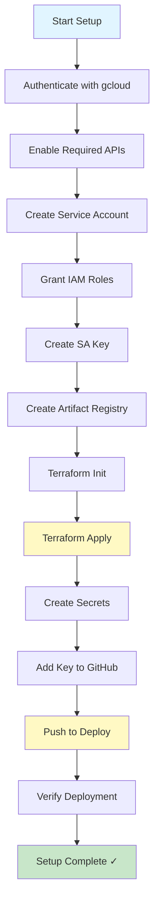
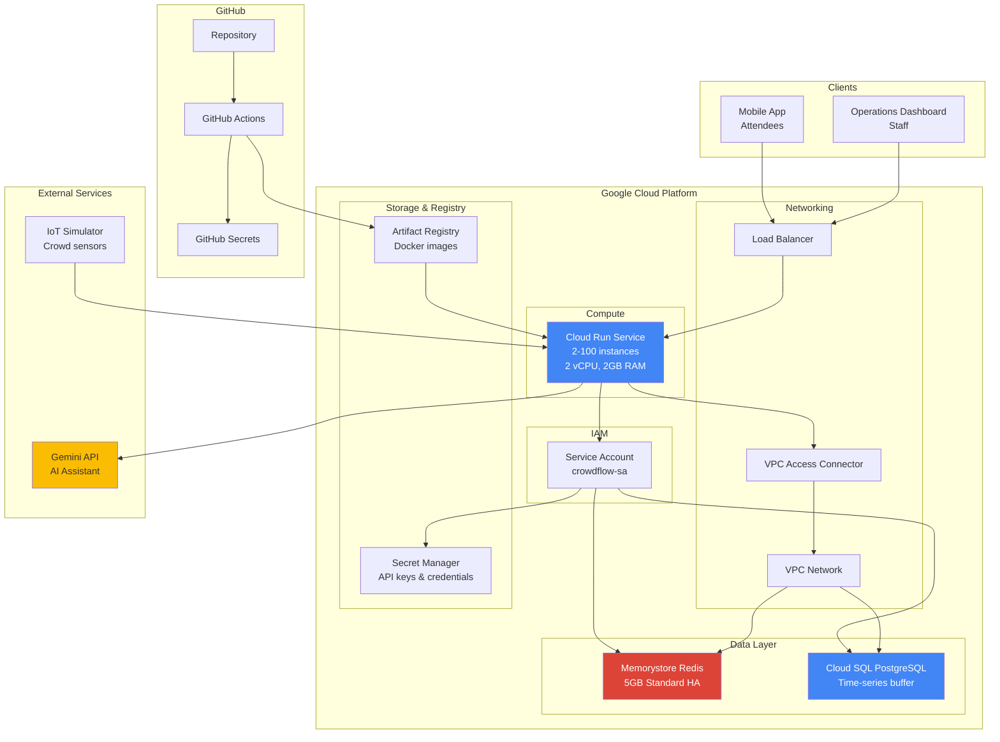
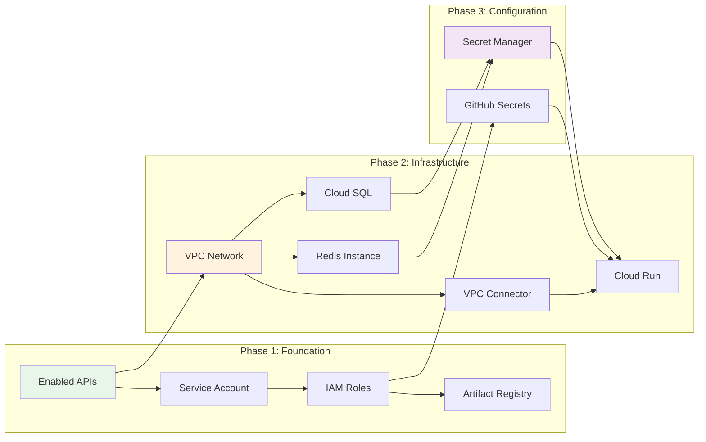
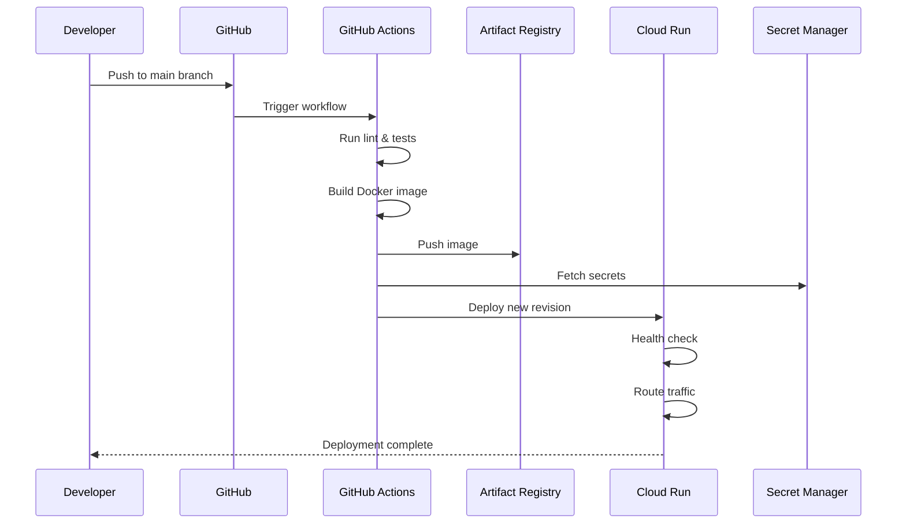
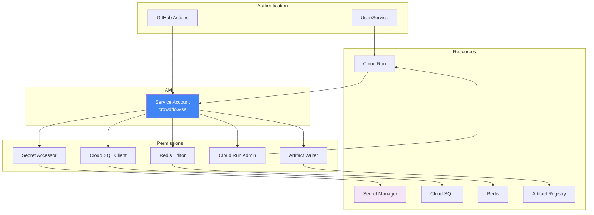
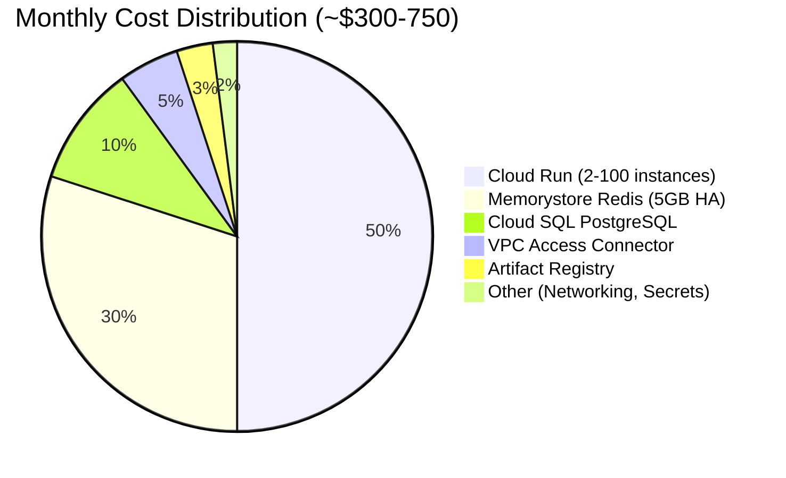
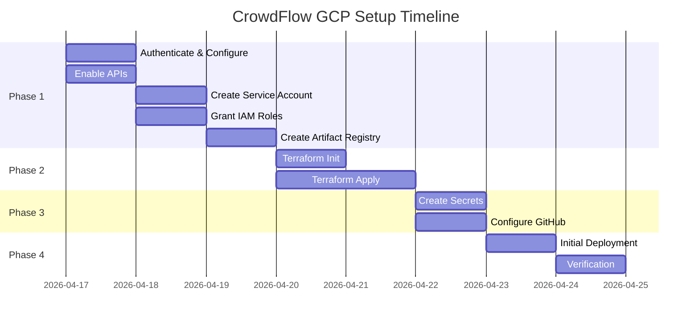
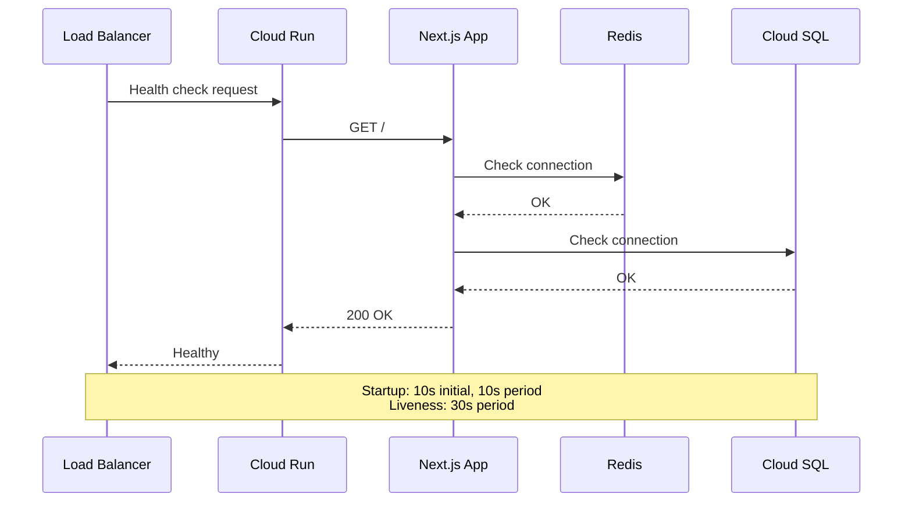
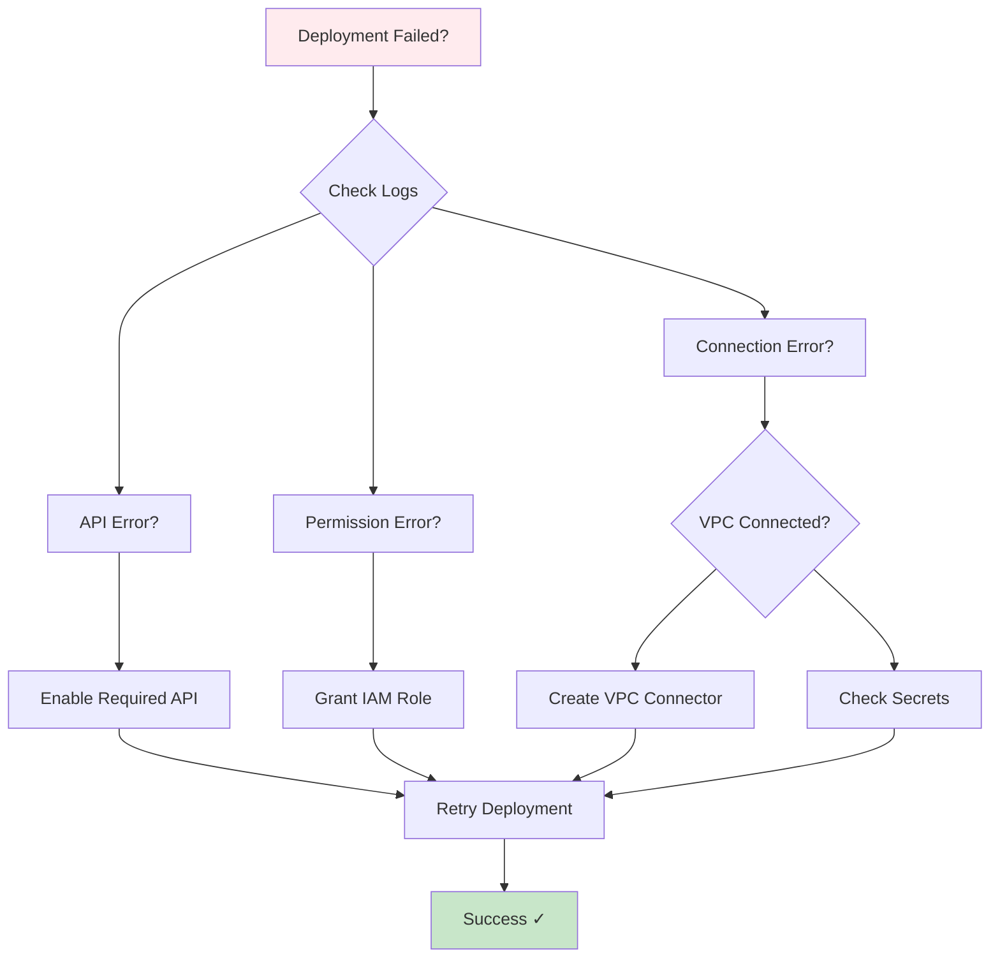

# CrowdFlow GCP Setup Flow Diagram

Visual guide showing the complete setup process and resource relationships.

## Setup Process Flow



## Infrastructure Architecture



## Resource Dependencies



## Deployment Pipeline Flow



## Data Flow Architecture

```mermaid
graph LR
    subgraph "Data Sources"
        IoT[IoT Sensors<br/>10s updates]
        User[User Requests]
    end

    subgraph "API Layer"
        Ingest[/api/iot/ingest]
        Crowd[/api/crowd/density]
        Queue[/api/queues/predictions]
        Nav[/api/wayfinding/route]
        AI[/api/assistant/chat]
    end

    subgraph "Processing"
        Validate[Validation]
        Calculate[Calculations]
        GeminiAPI[Gemini API]
    end

    subgraph "Storage"
        RedisCache[(Redis Cache<br/>Hot data)]
        TimeSeries[(Cloud SQL<br/>5min buffer)]
    end

    subgraph "Clients"
        Mobile[Mobile App]
        Dash[Dashboard]
    end

    IoT --> Ingest
    Ingest --> Validate
    Validate --> RedisCache
    Validate --> TimeSeries
    
    User --> Crowd
    User --> Queue
    User --> Nav
    User --> AI
    
    Crowd --> RedisCache
    Queue --> Calculate
    Calculate --> RedisCache
    Nav --> Calculate
    AI --> GeminiAPI
    
    RedisCache --> Mobile
    RedisCache --> Dash
    TimeSeries --> Calculate

    style RedisCache fill:#dc4437,color:#fff
    style TimeSeries fill:#4285f4,color:#fff
    style GeminiAPI fill:#fbbc04
```

## Security & Access Flow



## Cost Breakdown



## Setup Timeline



## Quick Navigation Guide

### 1. Initial Setup (0-10 min)
```bash
./scripts/gcp-setup.sh
```
**Creates:** Service account, IAM roles, Artifact Registry

### 2. Infrastructure (10-25 min)
```bash
cd terraform
terraform init
terraform apply
```
**Creates:** VPC, Redis, Cloud SQL, Cloud Run

### 3. Secrets (25-30 min)
```bash
./scripts/create-secrets.sh
```
**Creates:** REDIS_URL, DATABASE_URL, GEMINI_API_KEY

### 4. GitHub (30-32 min)
- Add `gcp-sa-key.json` to GitHub Secrets

### 5. Deploy (32-42 min)
```bash
git push origin main
```
**Triggers:** GitHub Actions → Build → Deploy

### 6. Verify (42-45 min)
```bash
gcloud run services describe crowdflow-platform --region=asia-south1
```

## Resource Naming Convention

| Resource Type | Name Pattern | Example |
|--------------|--------------|---------|
| Service Account | `{app}-sa` | `crowdflow-sa` |
| Cloud Run Service | `{app}-platform` | `crowdflow-platform` |
| Redis Instance | `{app}-cache` | `crowdflow-cache` |
| Cloud SQL Instance | `{app}-db-instance` | `crowdflow-db-instance` |
| VPC Network | `{app}-vpc` | `crowdflow-vpc` |
| VPC Connector | `{app}-connector` | `crowdflow-connector` |
| Artifact Registry | `{app}` | `crowdflow` |
| Secrets | `UPPER_SNAKE_CASE` | `REDIS_URL` |

## Health Check Flow



## Troubleshooting Decision Tree



---

## Quick Reference Links

- **Setup Guide:** `GCP_SETUP_GUIDE.md`
- **Checklist:** `GCP_SETUP_CHECKLIST.md`
- **Scripts:** `scripts/README.md`
- **Terraform:** `terraform/main.tf`
- **GitHub Actions:** `.github/workflows/deploy.yml`

---

**Last Updated:** April 2026
