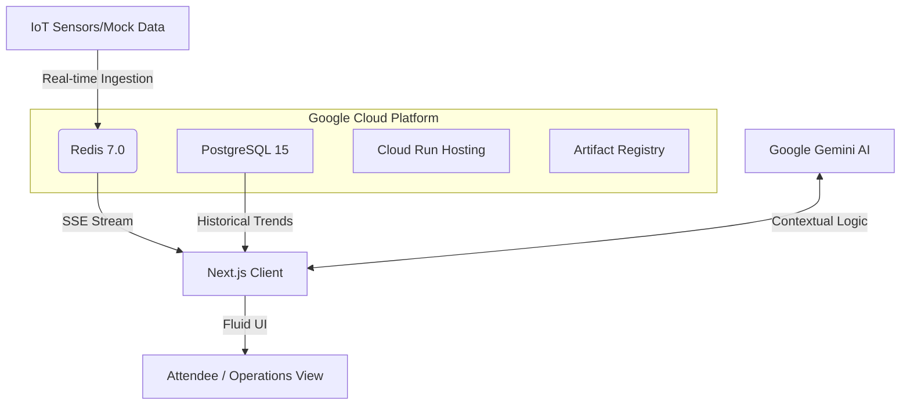

# ⚡ CrowdFlow: Venue Intelligence Platform

> **The Fluid Concierge for Premium Event Navigation**

CrowdFlow is a state-of-the-art venue intelligence platform designed to transform the attendee experience through real-time crowd telemetry and AI-driven wayfinding. By synthesizing IoT data with generative AI, CrowdFlow ensures seamless navigation, safety, and operational efficiency for large-scale events.

---

## 🚀 Vision
*Empowering event organizers and attendees with a "Fluid Concierge" that anticipates needs, optimizes movement, and provides real-time situational awareness.*

---

## ✨ Core Features

### 📊 Live Venue Pulse
Real-time crowd density monitoring across all sectors. High-fidelity heatmaps and saturation telemetry allow organizers to identify bottlenecks before they happen.

### 🤖 AI Fluid Concierge
Integrated with **Google Gemini**, our multi-modal AI assistant provides personalized directions, event info, and safety alerts tailored to the attendee's specific location and ticket level.

### 🗺️ Smart Wayfinding
Dynamic pathfinding that recalculates routes based on live traffic data. Attendees get the fastest, most comfortable path to their destination—be it the main stage, food court, or nearest exit.

### 🛡️ Sentinel Operations Console
A high-density "Cyber-Ops" command center for venue administrators. Features glassmorphism UI, real-time SSE streams, and incident command modules for ultimate control.

---

## 🛠️ Technology Stack

| Layer | Technologies |
| :--- | :--- |
| **Frontend** | [Next.js 16](https://nextjs.org/) (App Router), [React 18](https://react.dev/), [Tailwind CSS](https://tailwindcss.com/) |
| **Animation/UI** | [Framer Motion](https://www.framer.com/motion/), [Lucide React](https://lucide.dev/), `clsx` |
| **Intelligence** | [Google Generative AI](https://ai.google.dev/) (Gemini), SSE Real-time Streams |
| **Backend** | [PostgreSQL 15](https://www.postgresql.org/), [Redis 7.0](https://redis.io/), [Firebase Auth](https://firebase.google.com/) |
| **Infrastructure** | **GCP**: Cloud Run, Cloud SQL, Memorystore, Cloud CDN, Terraform |
| **Testing** | [Vitest](https://vitest.dev/), [Testing Library](https://testing-library.com/), [Fast-Check](https://github.com/dubzzz/fast-check) (Property-based) |

---

## 🏗️ Architecture



---

## 📦 Getting Started

### 1. Prerequisites
- Node.js 20+
- PostgreSQL & Redis (local or managed)
- Google Cloud CLI & Terraform

### 2. Local Installation
```bash
# Clone the repository
git clone https://github.com/your-org/crowdflow.git
cd crowdflow

# Install dependencies
npm install

# Environment setup
cp .env.local.template .env.local
# Edit .env.local with your credentials (REDIS_URL, DATABASE_URL, GEMINI_API_KEY)

# Start development server
npm run dev
```

### 3. Running Tests
```bash
# Unit & Integration Tests
npm run test

# Property-based testing
# Fast-check is integrated into the Vitest suite
```

---

## 🌩️ Infrastructure & Deployment

The platform is designed to run on **GCP** with high availability:
- **Compute**: Cloud Run (Autoscaling 2-100 instances)
- **Networking**: VPC Service Controls + Private Service Access
- **Deployment**: CI/CD via GitHub Actions to Artifact Registry & Cloud Run

For detailed setup, see [GCP Setup Guide](./docs/setup/readme-gcp.md).

---

## 🤖 Antigravity Kit Integration

This repository includes the **Antigravity Kit**, an advanced AI Agent system for autonomous development and system auditing.
- **Agents**: Orchestrator, Security Auditor, Frontend Specialist, etc.
- **Scripts**: `.agent/scripts/checklist.py` for pre-flight validation.

---

## 📄 License & Attribution
© 2026 CrowdFlow Platform. All rights reserved. Built with the **Antigravity Kit**.
